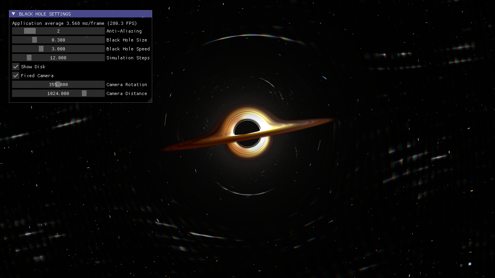
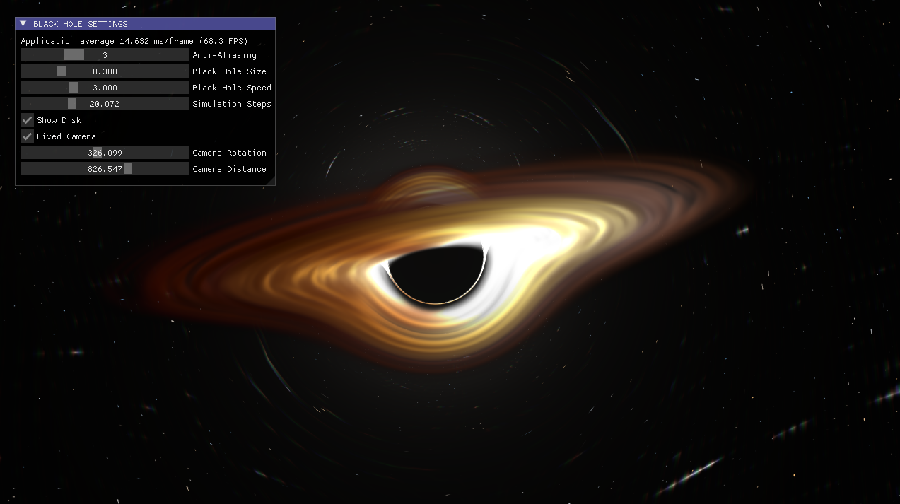
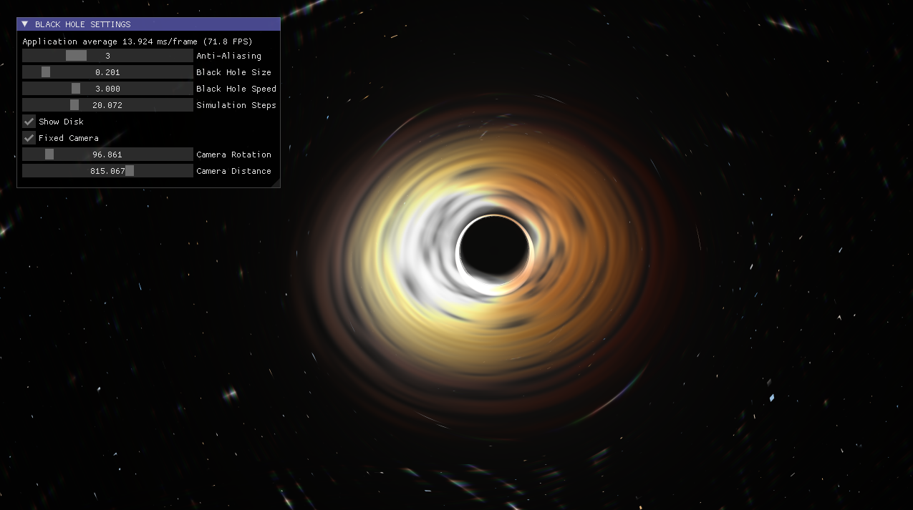

# Black Hole Simulation

This project visualizes a black hole  using OpenGL and ImGui. The shader code has been sourced from [Shadertoy](https://www.shadertoy.com/view/tsBXW3) and adapted for use in an OpenGL environment to create realistic visual effects and simulations.

## Screenshots

Here are some example screenshots of the simulation:

- **Example 1**:
  

- **Example 2**:
  

- **Example 3**:
  

## Features

- Simulates the gravitational effects around a black hole.
- Realistic black hole visuals created with shaders.
- Interactive user interface using ImGui for controlling the simulation.
- Dynamic visualization with adjustable parameters.

## Technologies Used

- **OpenGL**: The primary rendering technology for 3D graphics.
- **ImGui**: Lightweight and fast user interface solution.
- **GLFW**: Used for window creation and input handling.
- **GLM**: Mathematics library for vector and matrix computations.


## Getting Started

### Installation

To get the project up and running, you'll need to follow the setup instructions for your platform.

#### For Windows
1. Navigate to the `Scripts` folder in the project directory.
2. Run the Setup-Windows.bat batch file.

#### For Linux

1. Navigate to the `Scripts` folder in the project directory.

2. Make the `Setup-Linux.sh` script executable:
   
   ```bash
   chmod +x Setup-Linux.sh

3. Run the script to install necessary dependencies and set up the project:
   ```bash
   ./Setup-Linux.sh

